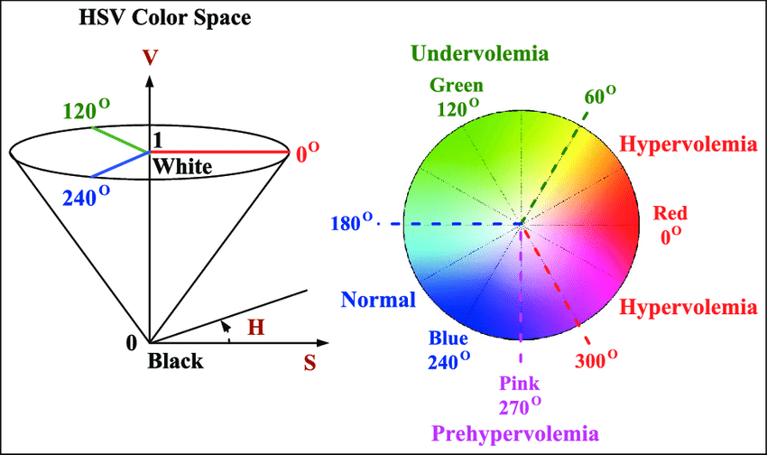

# self-driving-car-using-Reinforcement-learning
The main objective of this project is to design and implement an autonomous robot that learns to walk by itself using reinforcement learning. This is done by using artificial intelligence and image processing algorithms that allow the robot to move as efficiently as possible.

  

--



 __1. The hardware:__

* Arduino Romeo
* Raspberry Pi 4 (integrated WiFi)
* Pi Camera

__2. The software:__
* VNC Viewer : To remotely control the desktop interface of the Raspberry Pi
* C++ on the Arduino
* Python + Numpy + OpenCV  + Tensorflow on the Raspberry Pi
* Serial protocol for Arduino <-> Raspberry Pi

__3. Training the robot :__

The purpose of our reinforcement learning is to teach the robot to perform a sequence of actions to reach its objective which is always fixed, in order to facilitate the training we have limited the surface environment. The training takes place during episodes of a limited number of actions. The episode will be finished in 3 cases:
* The robot was able to reach its objective.
* The robot has exceeded the number of actions
allowed during the episode.
* The robot has left the environment.

  __3.1 Image processing :__

  The state of the environment is an image taken by a vertical camera and the reward function relies on the distance measurement to segment the space.
  To measure the distance with the camera above, we put a blue square on the robot and the target, we then convert our image from the RGB to HSV.

  
  

  

  __3.2 Training :__

  We finally trained our robot to move in a straight line towards its goal for 100 episodes, using a simplified state, a CNN neural network, and a randomness rate that decreases exponentially with the number of current episodes.

  During training, we observed quite satisfactory results, the robot starts little by little to know its optimal path that will maximize its score (straight line to the goal). And at the end of 100 episodes, the training was finally successful and we managed to train our robot. And this is clearly visible in the curves below, we have a score that increases throughout the training, and our cost function decreases and reaches 0 at the end of the of training.
 

